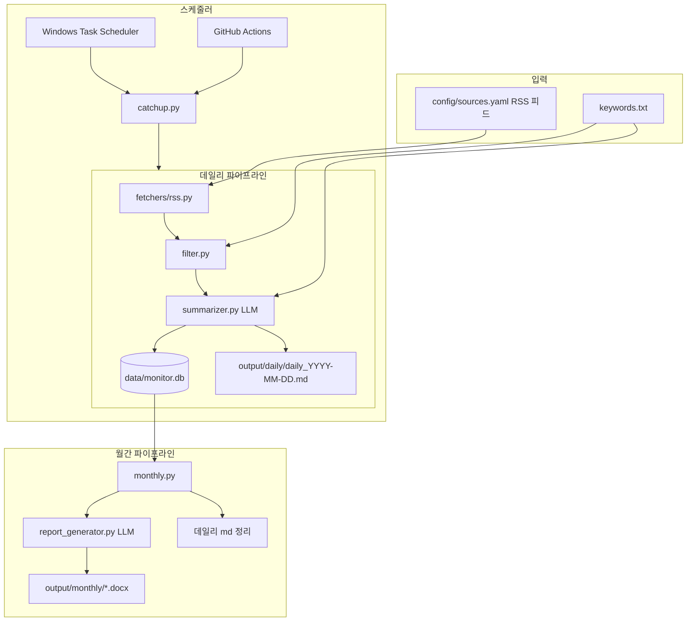

# Tech Market Intelligence Monitor

프라운호퍼 한국 사무소용 **기술 시장 모니터링 자동화 시스템**입니다.  
RSS/API에서 기사·논문을 수집하고, 키워드로 필터링한 뒤 LLM으로 요약하여 **데일리 마크다운 리서치 로그**와 **월간 Word 보고서(영문·한국어)**를 생성합니다.

> **이 README만으로 프로젝트를 재구축할 수 있도록** 아키텍처, 파일 구조, 비즈니스 규칙, LLM 프롬프트 규칙, 스케줄링 규칙을 모두 기록합니다.  
> 맨 아래 **「재구축 프롬프트」** 섹션을 AI에 그대로 붙여넣으면 코드베이스를 처음부터 다시 만들 수 있습니다.

---

## 목차

1. [한 줄 요약](#한-줄-요약)
2. [시스템 아키텍처](#시스템-아키텍처)
3. [빠른 시작](#빠른-시작)
4. [환경 변수](#환경-변수)
5. [설정 파일](#설정-파일)
6. [CLI 명령어](#cli-명령어)
7. [데일리 파이프라인 규칙](#데일리-파이프라인-규칙)
8. [데일리 리서치 로그 양식](#데일리-리서치-로그-양식)
9. [LLM 요약 규칙 (Summarizer)](#llm-요약-규칙-summarizer)
10. [월간 Word 보고서 규칙](#월간-word-보고서-규칙)
11. [신뢰 출처 정책](#신뢰-출처-정책)
12. [스케줄링 (로컬·클라우드)](#스케줄링-로컬클라우드)
13. [출력 경로](#출력-경로)
14. [프로젝트 구조](#프로젝트-구조)
15. [유틸리티 스크립트](#유틸리티-스크립트)
16. [재구축 프롬프트](#재구축-프롬프트)

---

## 한 줄 요약

```
매일:  RSS 수집 → 24시간 필터 → keywords.txt 매칭 → LLM 요약 → SQLite 저장 → daily_YYYY-MM-DD.md 생성
매월:  SQLite daily_logs 집계 → LLM JSON 합성 → .docx(EN/KO) 생성 → (선택) 데일리 md 삭제
```

---

## 시스템 아키텍처



### 데이터 저장 이중 구조

| 저장소 | 용도 |
|--------|------|
| `data/monitor.db` (SQLite) | 월간 보고서 생성의 **원본 데이터**. URL 중복 제거, 구조화된 요약 필드 보관 |
| `output/daily/daily_*.md` | 사람이 읽는 **데일리 리서치 로그**. GitHub Actions가 커밋 |
| `data/daily_scheduler_state.json` | 마지막으로 완료한 리포트 날짜 (`last_completed_log_date`) |

---

## 빠른 시작

```powershell
cd C:\Users\Admin\Documents\python-project
python -m venv .venv
.\.venv\Scripts\Activate.ps1
pip install -r requirements.txt
copy .env.example .env
# .env 에 API 키 입력
```

### 의존성 (`requirements.txt`)

```
feedparser>=6.0.11
httpx>=0.27.0
openai>=1.40.0
python-docx>=1.1.2
python-dotenv>=1.0.1
apscheduler>=3.10.4
pyyaml>=6.0.2
click>=8.1.7
```

Python **3.11** 권장 (GitHub Actions 기준).

---

## 환경 변수

`.env.example` 참고:

| 변수 | 기본값 | 설명 |
|------|--------|------|
| `OPENAI_API_KEY` | (필수) | LLM API 키 (OpenAI, Groq, Gemini 등 OpenAI 호환) |
| `OPENAI_BASE_URL` | 없음 | Groq: `https://api.groq.com/openai/v1`, Gemini: `https://generativelanguage.googleapis.com/v1beta/openai/` |
| `MODEL_NAME` | `gemini-2.0-flash` | 요약·월간 합성 모델 |
| `DEEPL_API_KEY` | (선택) | **예약 변수, 향후 사용 예정.** `src/config.py`의 `Settings.deepl_api_key`에 로드되지만, 현재 요약·데일리·월간 파이프라인 어디에서도 참조하지 않음 |
| `DATABASE_PATH` | `data/monitor.db` | SQLite 경로 |
| `REPORTS_OUTPUT_DIR` | `output/monthly` | 월간 .docx 출력 폴더 |
| `LOG_LEVEL` | `INFO` | 로깅 레벨 |
| `MAX_ARTICLES_PER_RUN` | `30` | 1회 실행당 LLM 요약 상한 (Groq 무료 티어 ~100k tokens/day 대응) |
| `SUMMARIZER_REQUEST_DELAY` | `1.0` | LLM 요청 간 대기(초), RPM 제한 대응 |
| `DAILY_LOG_RECORDER` | `Tech Market Monitor (auto)` | 데일리 md 상단 `기록자:` 필드 |

---

## 설정 파일

### `keywords.txt` — 키워드 필터 (한 줄 = 키워드 1개)

- `#`으로 시작하는 줄과 빈 줄은 무시
- **소문자로 정규화** 후 제목·요약·출처명에서 **부분 문자열 매칭**
- 이 파일만 수정하면 다음 실행부터 필터 키워드 변경
- **상위 3개 키워드**가 LLM `keyword_relevance` 분석 기준으로 사용됨

현재 주제: **전력계통·스마트그리드·BESS·AI 인프라·시장/투자** 등  
(전력계통, 파워그리드, power grid, smart grid, BESS, demand response, data center, AI infrastructure, market size, M&A, startup funding …)

### `config/sources.yaml` — RSS 소스 (7개 카테고리)

| 카테고리 | 예시 소스 |
|----------|-----------|
| `tech_news` | MIT Technology Review, TechCrunch, Wired, The Verge |
| `energy` | IEEE Spectrum, CleanTechnica, PV Magazine, Electrek |
| `semiconductor` | EE Times, SemiWiki, Tom's Hardware |
| `academic` | arXiv CS.AI, CS.LG, CS.AR, EESS.SY, EESS.SP |
| `enterprise` | Microsoft, Google, NVIDIA, AMD, Fraunhofer, TSMC |
| `market_intel` | Bloomberg, Reuters, Financial Times, Crunchbase |
| `korean` | ETRI, ZDNet Korea, 전자신문, IT Chosun |

각 항목 필수 필드: `name`, `url`, `category`  
`src/fetchers/registry.py`가 항목마다 `RSSFetcher` 1개 생성.

---

## CLI 명령어

```powershell
# ── 데일리 ──

# 어제 날짜 리포트 1회 실행 (기본)
python -m src.main daily

# 특정 날짜 1회 실행
python -m src.main daily --date 2026-06-17

# ★ 프로덕션 권장: 빠진 날짜 전부 순차 실행 (PC 꺼져 있었을 때 보충)
python -m src.main daily-catchup

# ── 월간 ──

# 이번 달 월간 보고서 (SQLite daily_logs 기반)
python -m src.main monthly

# 특정 월 + 데일리 md 유지
python -m src.main monthly --year 2026 --month 6 --no-cleanup

# ── 내장 스케줄러 (PC 켜져 있을 때) ──
python -m src.main schedule

# 데일리 catch-up 시작 시각·월간 cron 일 변경
python -m src.main schedule --daily-hour 9 --monthly-day last
python -m src.main schedule --daily-hour 8 --monthly-day 28
```

### CLI 옵션 요약

| 명령 | 옵션 | 기본값 | 설명 |
|------|------|--------|------|
| `daily` | `--date YYYY-MM-DD` | (없음 → **어제**) | 1회 실행. `log_date` 지정. 수집 창은 live 24h |
| `daily-catchup` | — | — | `last_completed_log_date` 다음날 ~ **오늘**까지 순차 실행 |
| `monthly` | `--year`, `--month` | (없음 → **이번 달**) | SQLite 기반 월간 Word 생성 |
| `monthly` | `--no-cleanup` | off | 해당 월 `daily_*.md` **유지** (기본은 삭제) |
| `schedule` | `--daily-hour INT` | `8` | `daily-catchup` 첫 실행 시각(로컬) |
| `schedule` | `--monthly-day last\|N` | `last` | 월간 job cron 일. `last`=말일, `N`=매월 N일 |

### `daily` vs `daily-catchup` 차이

| 명령 | 동작 |
|------|------|
| `daily` | **1회만** 실행. `--date` 없으면 **어제** 날짜 |
| `daily-catchup` | `last_completed_log_date` 다음날 ~ **오늘**까지 빠진 날짜를 **순서대로 전부** 실행 |

---

## 데일리 파이프라인 규칙

구현: `src/pipeline.py`, `src/catchup.py`, `src/scheduler_state.py`

### 1. 수집 (Fetch)

- 모든 RSS 피드를 순회, 실패한 fetcher는 로그 후 건너뜀
- `User-Agent: TechMarketMonitor/1.0`

### 2. 24시간 시간 창 필터

구현: `src/pipeline.py` (`_within_24h`), `src/catchup.py` (`window_end_for_log_date`)

| 명령 | `window_end` 전달 | 24h 창 끝 | 24h 창 시작 | 비고 |
|------|-------------------|-----------|-------------|------|
| `daily` (`--date` **미지정**) | `None` | **현재 시각** (UTC 변환) | 현재 − 24h | `log_date` = 어제. 파일명·DB 날짜용이며, **수집 창은 live** |
| `daily --date YYYY-MM-DD` | `None` | **현재 시각** | 현재 − 24h | 지정 `log_date`로 md·DB 저장. **수집 창은 live** (과거 날짜 backfill 아님) |
| `daily-catchup` — 과거 `log_date` | `(log_date + 1일) 08:00 KST` | 위 시각 | window_end − 24h | `catchup.py`가 `run_daily_monitor(window_end=…)` 호출 |
| `daily-catchup` — 오늘 `log_date` | **현재 시각 (KST)** | now | now − 24h | 당일 부분 리포트 |

- `window_end`가 `None`이면 **live 모드**: 상한 없이 `published_at ≥ (now − 24h)` 기사만 통과
- `window_end`가 지정되면 **고정 창**: `published_at`이 `[window_end − 24h, window_end]` 안에 있어야 통과
- `published_at` 없는 기사: **live** (`window_end=None`)에서만 포함, catch-up·고정 창에서는 제외

### 3. 키워드 필터

- `keywords.txt` 키워드 중 1개 이상 매칭해야 통과
- URL 중복 제거 (같은 실행 내)

### 4. 관련성 정렬 + 상한

- 매칭 키워드 수 내림차순 정렬
- `MAX_ARTICLES_PER_RUN`(기본 30) 초과분은 LLM 요약 생략

### 5. URL 중복 제거 (DB)

- `monitor.db`에 이미 저장된 URL은 재요약하지 않음
- 신규 기사 0건이면 요약·저장·md 생성 모두 스킵

### 6. LLM 요약 → SQLite 저장 → Markdown 생성

- SQLite `daily_logs` 테이블에 저장
- `save_daily_report()`로 `output/daily/daily_{log_date}.md` 생성
- 기사 0건이면 md 파일 생성 안 함

### Catch-up 상태 관리 (`data/daily_scheduler_state.json`)

```json
{
  "last_completed_log_date": "2026-06-21"
}
```

**핵심 규칙 (2026-06 수정 반영):**

> 리포트 **파일명 날짜 = log_date** 기준으로, `last_completed_log_date` **다음날부터 오늘까지** 빠진 날짜를 전부 생성.

| 상황 | 생성 리포트 |
|------|-------------|
| last=`2026-06-22`, 6/24에 PC 켬 | `daily_2026-06-23.md`, `daily_2026-06-24.md` |
| last=`2026-06-21`, 6/24에 PC 켬 | `daily_2026-06-22.md` ~ `daily_2026-06-24.md` (4개) |
| 매일 정상 실행 (6/23 8시, last=`2026-06-22`) | `daily_2026-06-23.md` **1개만** |

- 이미 `daily_YYYY-MM-DD.md` 파일이 있으면 파이프라인 재실행 없이 완료 처리
- state 파일 없으면 `output/daily/daily_*.md`에서 최신 날짜 추론
- 레거시 `last_completed_schedule_date` 필드는 `log_date = schedule_date - 1일`로 변환

### SQLite 스키마 (`daily_logs`)

| 컬럼 | 설명 |
|------|------|
| `log_date` | `YYYY-MM-DD` |
| `title`, `url` (UNIQUE), `source_name`, `category` | 기사 메타 |
| `published_at` | ISO datetime |
| `matched_keywords`, `key_trends` | JSON 배열 |
| `llm_summary` | 1문장 영문 헤드라인 + Source URL |
| `ko_summary_steps`, `en_summary_steps` | JSON 배열 (5단계 구조화 요약) |

---

## 데일리 리서치 로그 양식

파일명: **`daily_YYYY-MM-DD.md`**  
Cursor 규칙: `.cursor/rules/daily-research-log.mdc`

자동 생성(`src/daily_report.py`)과 수동 기록은 **같은 md 양식**을 쓰지만, 아래 두 절을 구분해 참고하세요.

### 파일 상단 메타데이터

```markdown
# 데일리 리서치 로그

날짜: YYYY-MM-DD
기록자: Tech Market Monitor (auto)
총 항목 수: N건 (기사 n / 논문 n)
신뢰도 분포: A n건 / B n건 / C n건
```

### Daily Executive Summary (2건 이상일 때만)

```markdown
## 오늘의 요약 (Daily Executive Summary)

(3~5줄 종합 서술 — 제목 나열 금지)

- **오늘의 핵심:** ...
- **눈여겨볼 신호:** ...
- **상충되는 정보:** (해당 없음) 또는 충돌 설명
```

### 항목 블록 (기사·논문 동일 양식)

```markdown
### [HH:MM 또는 순번] 제목

- **자료유형:** 기사 / 논문 / 보고서(시장조사) / 공식발표(IR·정책) / 기타
- **출처:**
- **저자/발행기관:**
- **발행일:** YYYY-MM-DD
- **링크/DOI:**
- **요약 (3~5줄):**
  - 사실 중심 bullet (2~3개)
  - 마지막 줄: `(해석) ...`
- **신뢰도:** A / B / C (또는 B (프리프린트, 동료심사 전))
- **태그:** #태그1 #태그2 (최대 4개)
- **비고:** (선택) 분석 키워드, 매칭 키워드
```

### 9. 데일리 로그 자동 생성 규칙 (코드 기준)

구현: `src/daily_report.py` — 파이프라인이 `save_daily_report()`로 md를 쓸 때만 적용.

**건수 계산 규칙:**
- `논문` = `_material_type() == "논문"` (category `academic`)
- `기사` = 전체 − 논문
- 상단 `신뢰도 분포`의 C 건수: `_credibility()` 결과의 첫 글자 기준. **자동 생성 시 C는 항상 0**

**자료유형 자동 분류 (`_material_type()`):**

| 조건 | 자료유형 |
|------|----------|
| `category == academic` | 논문 |
| Gartner/IDC/McKinsey/Statista 출처 | 보고서(시장조사) |
| 정부·.go.kr·MOTIE 등 | 공식발표(IR·정책) |
| 그 외 | 기사 |

**신뢰도 자동 등급 (`_credibility()`):**

| 등급 | 기준 |
|------|------|
| **A** | 피어리뷰(IEEE/Springer/Nature 등), Tier-1 통신사(Reuters/Bloomberg/AP), Tier-1 리서치(Gartner/IDC/McKinsey), 정부·.gov |
| **B** | 프리프린트(arXiv 등) → `B (프리프린트, 동료심사 전)`; 업계 매체, 기업 IR/보도자료, 2차 보도 → `B` |
| **C** | **현재 자동 분류 로직에는 C로 분류되는 조건이 없음.** `_credibility()`는 A, `B (프리프린트, 동료심사 전)`, `B`만 반환. (월간 집계용 `_is_c_grade_source()`는 블로그·SNS 등 C급 **제외** 필터이며, 데일리 md 항목 신뢰도 필드에는 쓰이지 않음) |

**태그 자동 추론 (`_infer_tags()`, 키워드 regex → 최대 4개):**

`#기술` `#논문` `#투자` `#M&A` `#제품출시` `#기업동향` `#규제` `#경쟁` `#시장수치` `#리스크` `#전문가전망`

파일 하단에 태그 분류체계·신뢰도 기준 표를 **항상 자동 포함**.

### 9-1. 수동 기록 시 템플릿 (예외 상황용)

**사람이 손으로 md를 작성할 때만** `templates/daily_research_log_template.md`를 참고합니다.  
자동 파이프라인(`python -m src.main daily` / `daily-catchup`)은 이 템플릿을 읽지 않으며, 위 **§9 코드 규칙**으로 md를 생성합니다.

수동 기록이 필요한 경우 예:
- 자동 수집·요약 파이프라인을 거치지 않은 자료를 보충할 때
- RSS에 없는 오프라인 자료(대면 미팅 메모, 내부 공유 자료 등)를 같은 날 로그에 합칠 때

수동 기록 시 **신뢰도 C** 사용 기준 (`templates/daily_research_log_template.md` 하단과 동일):
- **C (참고):** 익명 소스, 추측성 기사, 단순 재가공 콘텐츠, 미검증 블로그

수동 기록 시에도 파일명·상단 메타·항목 블록·하단 표 형식은 자동 생성 md와 동일하게 맞춥니다.

---

## LLM 요약 규칙 (Summarizer)

구현: `src/summarizer.py`

### 목적

시장 조사 관점 요약. 기술 설명이 아니라 **시장 규모·투자·경쟁·공급망·상용화 함의** 중심.

### JSON 출력 스키마

```json
{
  "summary": "1문장 영문 헤드라인. 반드시 Source: <url> 포함",
  "en_summary_steps": ["**Overview:** ...", "**What's the Development:** ...", "**Why It Stands Out:** ...", "**Market Potential:** ...", "**Investment Outlook:** ..."],
  "ko_summary_steps": ["**개요:** ...", "**핵심 내용:** ...", "**기술적 차별성:** ...", "**시장 파급력:** ...", "**투자·미래 전망:** ..."],
  "key_trends": ["시장 트렌드 1", "시장 트렌드 2"],
  "keyword_relevance": "한국어 통합 서술 (keywords.txt 상위 3개와 이 기사의 연관)"
}
```

### 한국어 생성 규칙 (CRITICAL — 반드시 준수)

1. **직역 금지**: `en_summary_steps`의 번역이 아님. 한국 독자용으로 독립 재서술
2. **keyword_relevance**: keywords.txt **상위 3개**와 **이 기사**의 연결만. 키워드별 문단 분리(`OO와 관련하여`) 금지. 키워드 정의·일반론 금지
3. **사실 정확성**: 수치·날짜·기업명 100% 원문 일치. 없는 내용 추론 금지
4. **전문 용어 직역 금지** (에너지·전력):
   - flexible load → `수요조절 가능 부하` (금지: `유연 부하`)
   - flexible demand → `수요조절(DR) 자원`
   - load holder → `수요조절 참여 기업·시설` (금지: `부하 보유자`)
   - demand response → `수요반응(DR)`
   - grid stability → `전력망 안정성` / `계통 안정성`
5. **종결어미**: `-함`, `-임`, `-전망됨`, `-분석됨` 등 **명사형**. `-습니다/ㅂ니다` **절대 금지**
6. **약어**: 첫 등장 시 괄호 병기 (예: `CAGR(연평균 성장률)`, `BESS(배터리 에너지 저장장치)`)
7. **후처리**: `polish_korean()`이 `유연 부하 보유자` 등 잔여 직역어 자동 교정

### API 호출

- OpenAI 호환 `chat.completions.create`, `response_format: json_object`
- `temperature: 0.2`
- Rate limit 시 exponential backoff (최대 5회)
- 요청 간 `SUMMARIZER_REQUEST_DELAY` 초 대기

---

## 월간 Word 보고서 규칙

구현: `src/report_generator.py`, `src/monthly.py`

### 데이터 소스

- **`data/monitor.db`의 `daily_logs`** (데일리 md 아님!)
- 해당 월 `log_date LIKE 'YYYY-MM-%'` 조회

### 출력 파일

| 파일 | 설명 |
|------|------|
| `output/monthly/tech-market-report-YYYY-MM.docx` | 영문 TMR |
| `output/monthly/tech-market-report-YYYY-MM-ko.docx` | 한국어 TMR |

### LLM 합성 → JSON → Word 빌드

1. SQLite 로그를 `[ref]` 번호와 함께 LLM에 전달
2. LLM이 9개 섹션 JSON 반환 (`sec1`~`sec9`)
3. `_build_document()` / `_build_document_ko()`가 Word 생성

### 인용 규칙 (엄격)

- 모든 사실·통계·트렌드 문장 끝에 **`[N]`** (N = 기사 ref 번호)
- 제공 데이터에 없는 내용 **생성·추론 금지**
- 근거 없으면 **`N/A`**

### Metrics Dashboard 규칙

- `value`, `yoy`, `forecast`: 기사에 **명시된 수치만**. 없으면 `N/A` / `–` / `N/A`
- `source`: 해당 수치를 **직접 언급한 기사의 출처명** 그대로 (Gartner/IDC 등 기사에 없으면 넣지 않음)
- TRL, 특허 출원국, 시장점유율: 기사에 없으면 전부 N/A

### sec1.key_findings — 반드시 4개

| # | 유형 | 내용 |
|---|------|------|
| 1 | Market signal / 시장 신호 | 글로벌 시장·투자·수요 (모든 분야 포함) |
| 2 | Competitive signal / 경쟁 신호 | 특정 기업 전략적 움직임 |
| 3 | Korea-specific / 한국 특화 | 한국 시장·정책·기업 |
| 4 | Risk signal / 리스크 | 공급망·규제·기술 병목 |

### sec2.definition

- 첫 문장에 **`technology_name` 필드의 기술명을 그대로** 사용
- "이 기술은..." 같은 모호한 표현 금지

### N/A 처리 (문서 빌더)

구현: `src/report_generator.py` — `_is_na()`, `_has_real_data()`, `_has_real_text()`

- 텍스트 필드 전체가 근거 없으면 `"N/A"` 한 단어 (문장 안에 N/A 넣지 않음)
- `TRL X`, `X년` 같은 **템플릿 placeholder**는 `_is_na()`로 감지하여 **섹션 통째로 생략**
- `_has_real_data()`, `_has_real_text()`로 **동적 섹션 번호** 부여 (빈 섹션은 번호 건너뜀)

**`_is_na(val)` 동작:**
- `str(val).strip()`이 아래이면 `True`: `n/a`, `–`, `-`, `""`, `na`, `n.a.`, `not available`, `unknown` (대소문자 무시)
- 또는 `_PLACEHOLDER_RE` 정규식에 매칭되면 `True` (미채움 LLM placeholder):
  - `TRL X` / `TRL ?` / `TRL 0`
  - `X년`, `X years`, `X yr`
  - `기술명`, `tech`, `technology`
  - `driver N`, `barrier N`
  - `X%`, `X billion`, `X million`, `X B`, `X M`
  - `$X`, `€X`, `¥X`, `₩X` (B/M 접미 가능)

**`_has_real_data(items, keys)` 동작:**
- `items` 리스트에서 **어느 한 항목**이라도 `keys` 중 하나에 대해 `_is_na()`가 `False`이면 `True`
- 모든 항목·모든 키가 비어 있거나 N/A/placeholder이면 `False` → 해당 표·하위 섹션 생략

**`_has_real_text(text)` 동작:**
- `_is_na(text)`의 반대. 비어 있지 않고 N/A·placeholder가 아니면 `True` → 단락·스냅샷 문단 포함

### 표지 (한국어)

| 필드 | 값 |
|------|-----|
| 제목 | 기술 시장 조사 보고서 |
| 부제 | 프라운호퍼 연구소 \| 한국 사무소 |
| 기술명 / 보고서 기간 / 작성자 / 버전 / 분류 | (JSON에서) |

> **주의:** 예전 버전의 `부서 | 기술 인텔리전스 팀` 행은 **제거됨**. 표지에 부서 필드 넣지 않음.

### 월간 실행 후 데일리 md 정리

- `monthly` 기본: 해당 월 `daily_YYYY-MM-*.md` **삭제**
- `--no-cleanup`: 유지 (GitHub Actions 월간 워크플로는 `--no-cleanup` 사용)

### 월말 실행 조건

구현: `run_monthly_if_last_bizday.py` — `last_business_day_of_month(year, month)`

1. 해당 월 **말일(달력 기준)**을 구함
2. 말일이 **토(5)·일(6)**이면 하루씩 거슬러 올라가 **월~금**이 될 때까지 후퇴
3. **오늘 == 위 날짜**일 때만 `run_monthly_report(year, month, cleanup_daily=True)` 실행, 아니면 exit 0 (skip)

**영업일 판단 범위:** `weekday()` 기준 **월~금만** (공휴일 캘린더·한국/미국 휴일 API **미사용**). 예: 6월 말일이 일요일이면 마지막 영업일은 금요일.

- Windows Task Scheduler: 매일 18:30 트리거 → **`run_monthly_if_last_bizday.py`를 직접 실행** (스크립트 import)
- GitHub Actions `monthly-report.yml` (scheduled): **`run_monthly_if_last_bizday.py --check-only`를 먼저 시도**하나, 스크립트에 해당 플래그가 없어 **실패 후 yaml 안의 인라인 Python fallback**으로 동일 알고리즘을 **별도 복사본**으로 검사. 마지막 영업일이 아니면 monthly 단계 skip. `workflow_dispatch`(수동 실행)는 영업일 검사 없이 바로 monthly 실행

> **유지보수 주의:** 영업일 알고리즘은 `run_monthly_if_last_bizday.py`와 `monthly-report.yml` 인라인 블록 **두 곳**에 존재. 로직 변경 시 **양쪽을 함께** 수정해야 drift 방지.

---

## 신뢰 출처 정책

Cursor 규칙: `.cursor/rules/reliable-sources.mdc` (`alwaysApply: true`)

리서치·인용 시 **승인 목록만** 사용. 블로그, Wikipedia, 검증 안 된 매체 금지.

### 주요 승인 출처 (요약)

| 분류 | 출처 |
|------|------|
| 학술 | IEEE, ACM, arXiv, Springer/Elsevier/Wiley, Fraunhofer-Publica |
| 시장 | Gartner, IDC, Statista, McKinsey MGI, OECD |
| 특허 | Espacenet, DPMA, Google Patents, KIPO |
| 정부 | EU Commission, NIST, IEA, MOTIE, MSIT, KISTEP, IITP |
| 언론 | MIT Technology Review, Nature News, Financial Times Tech |
| 한국 | KIET, ETRI, KISDI, KOSTAT, KOITA, KOTRA |
| 아시아 | ADB, METI/NEDO, MIIT/CAICT, NITI Aayog, EDB Singapore |

**규칙:** 1차 출처 인용, 페이월이면 DOI/공식 URL 명시, 승인 목록에 없으면 "승인 출처 없음" 명시.

---

## 스케줄링 (로컬·클라우드)

### Windows Task Scheduler (`setup_scheduler.ps1`)

관리자 PowerShell:

```powershell
Set-ExecutionPolicy -Scope Process -ExecutionPolicy Bypass -Force
C:\Users\Admin\Documents\python-project\setup_scheduler.ps1
```

| 작업명 | 시간 | 명령 |
|--------|------|------|
| `TechMarketMonitor-Daily` | 매일 08:00 | `python -m src.main daily-catchup` |
| `TechMarketMonitor-Monthly` | 매일 18:30 | `python run_monthly_if_last_bizday.py` |

설정: `StartWhenAvailable`, 4시간 제한, 실패 시 10분 간격 2회 재시도.

> **중요:** 예전 `python -m src.main daily` 명령은 **daily-catchup으로 교체됨**. PC를 며칠 꺼두어도 빠진 날짜가 전부 보충됨.

### GitHub Actions

| 워크플로 | cron (UTC) | KST | 동작 |
|----------|------------|-----|------|
| `.github/workflows/daily-monitor.yml` | `0 23 * * *` | 08:00 | `daily-catchup` → md + db + state 커밋 |
| `.github/workflows/monthly-report.yml` | `0 23 * * *` | 08:00 | scheduled: yaml **인라인 Python**으로 마지막 영업일 검사 → monthly. 수동 dispatch는 검사 생략 |

Secrets: `OPENAI_API_KEY`, `OPENAI_BASE_URL`, `MODEL_NAME`

수동 실행: Actions → Run workflow → 날짜/년월 입력 가능.

> RSS는 보통 24~48시간치만 유지. 2일 이상 지난 날짜 backfill은 기사 없을 가능성 높음.

---

## 출력 경로

| 경로 | 내용 |
|------|------|
| `output/daily/daily_YYYY-MM-DD.md` | 데일리 리서치 로그 |
| `output/monthly/tech-market-report-YYYY-MM.docx` | 영문 월간 |
| `output/monthly/tech-market-report-YYYY-MM-ko.docx` | 한국어 월간 |
| `data/monitor.db` | SQLite 원본 |
| `data/daily_scheduler_state.json` | catch-up 상태 |
| `output/logs/daily.log` | **Windows Task Scheduler 전용 예약 경로.** `setup_scheduler.ps1`이 `$LOGDIR`(`output/logs`)와 `$DailyLog` 변수를 정의하지만, **현재 등록되는 Scheduled Task에는 stdout/stderr 리다이렉션이 연결되어 있지 않음** — 실행 시 로그는 Python `logging.basicConfig` 기본 출력(stderr/stdout)으로만 남음. **GitHub Actions**는 `output/logs` 디렉터리만 생성(`.github/workflows/daily-monitor.yml`)하고 `daily.log`에 **기록하지 않음** (워크플로 runner 로그에 stdout만 출력) |
| `templates/daily_research_log_template.md` | 수동 기록용 양식 |

---

## 프로젝트 구조

```
python-project/
├── .cursor/rules/
│   ├── daily-research-log.mdc    # 데일리 md 편집 규칙
│   └── reliable-sources.mdc      # 신뢰 출처 정책 (alwaysApply)
├── .github/workflows/
│   ├── daily-monitor.yml
│   └── monthly-report.yml
├── config/
│   └── sources.yaml              # RSS 소스 7카테고리
├── data/
│   ├── monitor.db
│   └── daily_scheduler_state.json
├── output/
│   ├── daily/                    # daily_YYYY-MM-DD.md
│   └── monthly/                  # tech-market-report-*.docx
├── templates/
│   └── daily_research_log_template.md
├── src/
│   ├── main.py                   # CLI (daily, daily-catchup, monthly, schedule)
│   ├── catchup.py                # 빠진 날짜 순차 실행
│   ├── scheduler_state.py        # last_completed_log_date 관리
│   ├── pipeline.py               # fetch → filter → summarize → store → md
│   ├── daily_report.py           # Markdown 리서치 로그 생성
│   ├── summarizer.py             # LLM 요약 + 한국어 규칙
│   ├── filter.py                 # keywords.txt 매칭
│   ├── storage.py                # SQLite DailyLogStore
│   ├── monthly.py                # 월간 집계 + md 정리
│   ├── report_generator.py       # LLM JSON 합성 + Word 빌드 (EN/KO)
│   ├── config.py                 # Settings, load_sources()
│   ├── models.py                 # RawArticle, FilteredArticle, SummarizedArticle
│   └── fetchers/
│       ├── registry.py
│       ├── rss.py
│       └── base.py
├── keywords.txt
├── requirements.txt
├── .env / .env.example
├── setup_scheduler.ps1
├── run_monthly_if_last_bizday.py
├── generate_sample_reports.py    # 샘플 데일리·월간 생성
├── regen_daily_report.py         # DB 기사 재요약 → md 재생성
└── generate_ko_offline.py        # LLM 없이 캐시 JSON으로 KO docx 생성
```

---

## 유틸리티 스크립트

```powershell
# 샘플 리포트 생성 (프롬프트 설정 반영 확인용)
python generate_sample_reports.py

# 특정 날짜 DB 기사 재요약 → daily md 재생성
python regen_daily_report.py 2026-06-21

# LLM 토큰 한도 초과 시 한국어 월간 오프라인 빌드
python generate_ko_offline.py
```

---

## 재구축 프롬프트

아래 블록을 AI 코딩 도구에 **그대로 붙여넣으면** 이 프로젝트를 처음부터 재구현할 수 있습니다.

---

```
Python 3.11 프로젝트 "Tech Market Intelligence Monitor"를 만들어줘.

## 목적
프라운호퍼 한국 사무소용 기술 시장 모니터링. RSS에서 기사·논문 수집 → keywords.txt 필터 → OpenAI 호환 LLM 요약 → SQLite 저장 → daily_YYYY-MM-DD.md 생성 → 월말 Word 보고서(EN/KO).

## 의존성
feedparser, httpx, openai, python-docx, python-dotenv, apscheduler, pyyaml, click

## 핵심 모듈
- src/fetchers/rss.py: feedparser로 RSS 수집 → RawArticle
- src/filter.py: keywords.txt 부분 문자열 매칭 → FilteredArticle
- src/summarizer.py: LLM JSON 요약 (en/ko 5단계 + keyword_relevance)
- src/storage.py: SQLite daily_logs (url UNIQUE, ko/en_summary_steps JSON)
- src/pipeline.py: fetch→24h filter→keyword filter→관련성 정렬→MAX_ARTICLES_PER_RUN(30) cap→URL dedup→summarize→store→save_daily_report
- src/daily_report.py: daily_YYYY-MM-DD.md (기사+논문 통합 양식, 2건 이상 Executive Summary, 자료유형/신뢰도/태그 자동 분류)
- src/catchup.py + scheduler_state.py: last_completed_log_date 다음날~오늘까지 빠진 log_date 순차 실행
- src/report_generator.py: SQLite logs→LLM JSON(sec1-9)→Word. [N] 인용 필수, N/A면 섹션 생략, metrics는 기사 수치만, 표지에 부서 행 없음
- src/monthly.py: SQLite 월간 집계→EN/KO docx→daily md cleanup
- src/main.py CLI (click): daily, daily-catchup, monthly, schedule
- run_monthly_if_last_bizday.py: last_business_day_of_month() — 말일에서 토·일만 후퇴, 공휴일 미반영. 오늘이 마지막 영업일일 때만 monthly 실행

## CLI 명령어
- daily [--date YYYY-MM-DD]: 1회 실행. --date 없으면 log_date=어제. window_end=None(live 24h)
- daily-catchup: last_completed_log_date 다음날~오늘까지 빠진 log_date 순차 실행
- monthly [--year INT] [--month INT] [--no-cleanup]: SQLite 월간 집계→EN/KO docx. year/month 생략 시 이번 달. 기본은 해당 월 daily_*.md 삭제, --no-cleanup이면 유지
- schedule [--daily-hour INT] [--monthly-day last|N]: BlockingScheduler. daily-catchup 24h 주기, monthly는 monthly-day(기본 last) cron

## 설정
- keywords.txt: 한 줄=키워드, # 주석
- config/sources.yaml: tech_news, energy, semiconductor, academic, enterprise, market_intel, korean 카테고리 RSS
- .env: OPENAI_API_KEY, OPENAI_BASE_URL, MODEL_NAME, DEEPL_API_KEY(예약·현재 미사용), DATABASE_PATH, REPORTS_OUTPUT_DIR, LOG_LEVEL, MAX_ARTICLES_PER_RUN, SUMMARIZER_REQUEST_DELAY, DAILY_LOG_RECORDER(데일리 md 기록자:, 기본 Tech Market Monitor (auto))

## 24h 시간 창 (window_end)
- daily (--date 미지정): window_end=None → live, 현재 시각 기준 과거 24h, log_date=어제
- daily --date YYYY-MM-DD: window_end=None → live, log_date=지정일 (수집 창은 live, 과거 backfill 아님)
- daily-catchup 과거 log_date: window_end=(log_date+1일) 08:00 KST
- daily-catchup 오늘 log_date: window_end=현재 시각
- published_at 없는 기사: window_end=None(live)에서만 포함

## 스케줄
- setup_scheduler.ps1: 08:00 daily-catchup, 18:30 run_monthly_if_last_bizday.py (월~금 말일만, 공휴일 무시)
- GitHub Actions monthly: scheduled 시 yaml 인라인 Python으로 동일 영업일 검사(스크립트 import 아님, 로직 중복). 수동 dispatch는 검사 생략

## 출력
- output/daily/daily_YYYY-MM-DD.md
- output/monthly/tech-market-report-YYYY-MM.docx / -ko.docx
- data/monitor.db

## 데일리 md 양식 (자동 생성 — src/daily_report.py)
상단: 날짜, 기록자, 총 항목(기사n/논문n), 신뢰도 A/B/C 분포 (자동 시 C=0)
항목: 자료유형, 출처, 저자, 발행일, 링크, 요약 3~5줄(마지막 (해석)), 신뢰도, 태그, 비고
하단: 태그 분류체계 표 + 신뢰도 기준

### 자료유형 자동 분류표 (_material_type)
| 조건 | 자료유형 |
|------|----------|
| category == academic | 논문 |
| Gartner/IDC/McKinsey/Statista 출처 | 보고서(시장조사) |
| 정부·.go.kr·MOTIE 등 | 공식발표(IR·정책) |
| 그 외 | 기사 |

### 신뢰도 자동 등급 (_credibility)
| 등급 | 기준 |
|------|------|
| A | 피어리뷰(IEEE/Springer/Nature 등), Tier-1 통신사(Reuters/Bloomberg/AP), Tier-1 리서치(Gartner/IDC/McKinsey), 정부·.gov |
| B | 프리프린트(arXiv 등)→B (프리프린트, 동료심사 전); 업계 매체, 기업 IR/보도자료, 2차 보도→B |
| C | 자동 분류에 C 조건 없음. A/B/B(프리프린트)만 반환 |

### 태그 자동 추론 (최대 4개)
#기술 #논문 #투자 #M&A #제품출시 #기업동향 #규제 #경쟁 #시장수치 #리스크 #전문가전망

## LLM 요약 JSON 스키마 (summarizer.py)
{
  "summary": "1문장 영문 헤드라인. 반드시 Source: <url> 포함",
  "en_summary_steps": ["**Overview:** ...", "**What's the Development:** ...", "**Why It Stands Out:** ...", "**Market Potential:** ...", "**Investment Outlook:** ..."],
  "ko_summary_steps": ["**개요:** ...", "**핵심 내용:** ...", "**기술적 차별성:** ...", "**시장 파급력:** ...", "**투자·미래 전망:** ..."],
  "key_trends": ["시장 트렌드 1", "시장 트렌드 2"],
  "keyword_relevance": "한국어 통합 서술 (keywords.txt 상위 3개와 이 기사의 연관)"
}

### 한국어 생성 규칙 (CRITICAL — 반드시 준수)
1. 직역 금지: en_summary_steps의 번역이 아님. 한국 독자용으로 독립 재서술
2. keyword_relevance: keywords.txt 상위 3개와 이 기사의 연결만. 키워드별 문단 분리(OO와 관련하여) 금지. 키워드 정의·일반론 금지
3. 사실 정확성: 수치·날짜·기업명 100% 원문 일치. 없는 내용 추론 금지
4. 전문 용어 직역 금지 (에너지·전력):
   - flexible load → 수요조절 가능 부하 (금지: 유연 부하)
   - flexible demand → 수요조절(DR) 자원
   - load holder → 수요조절 참여 기업·시설 (금지: 부하 보유자)
   - demand response → 수요반응(DR)
   - grid stability → 전력망 안정성 / 계통 안정성
5. 종결어미: -함, -임, -전망됨, -분석됨 등 명사형. -습니다/ㅂ니다 절대 금지
6. 약어: 첫 등장 시 괄호 병기 (예: CAGR(연평균 성장률), BESS(배터리 에너지 저장장치))
7. 후처리: polish_korean()이 유연 부하 보유자 등 잔여 직역어 자동 교정

## 신뢰 출처 정책
IEEE, ACM, arXiv, Springer/Elsevier/Wiley, Fraunhofer-Publica, Gartner, IDC, Statista, McKinsey MGI, OECD, Espacenet, DPMA, Google Patents, KIPO, EU Commission, NIST, IEA, MOTIE, MSIT, KISTEP, IITP, MIT Technology Review, Nature News, Financial Times Tech, KIET, ETRI, KISDI, KOSTAT, KOITA, KOTRA, ADB, METI/NEDO, MIIT/CAICT, NITI Aayog, EDB Singapore 등 승인 목록만 인용.
규칙: 1차 출처 인용, 페이월이면 DOI/공식 URL 명시, 승인 목록에 없으면 "승인 출처 없음" 명시.

## 월간 Word 보고서 (report_generator.py)
- 데이터: SQLite daily_logs (데일리 md 아님)
- 인용: 모든 사실·통계·트렌드 문장 끝 [N]. 제공 데이터에 없는 내용 생성·추론 금지. 근거 없으면 N/A
- Metrics: value/yoy/forecast는 기사 명시 수치만. 없으면 N/A/–/N/A. source는 해당 수치를 직접 언급한 기사 출처명
- sec2.definition: 첫 문장에 technology_name 필드 기술명 그대로. "이 기술은..." 금지
- 표지(한국어): 제목=기술 시장 조사 보고서, 부제=프라운호퍼 연구소 | 한국 사무소. 부서 행 없음

### sec1.key_findings — 반드시 4개
| # | 유형 | 내용 |
|---|------|------|
| 1 | Market signal / 시장 신호 | 글로벌 시장·투자·수요 (모든 분야 포함) |
| 2 | Competitive signal / 경쟁 신호 | 특정 기업 전략적 움직임 |
| 3 | Korea-specific / 한국 특화 | 한국 시장·정책·기업 |
| 4 | Risk signal / 리스크 | 공급망·규제·기술 병목 |

### N/A 처리 (_is_na, _has_real_data, _has_real_text)
- 텍스트 필드 전체가 근거 없으면 "N/A" 한 단어 (문장 안에 N/A 넣지 않음)
- TRL X, X년 등 템플릿 placeholder는 _is_na()로 감지 → 섹션 통째 생략
- _has_real_data(), _has_real_text()로 동적 섹션 번호 (빈 섹션 번호 건너뜀)

_is_na(val): str(val).strip()이 n/a, –, -, "", na, n.a., not available, unknown (대소문자 무시)이거나 _PLACEHOLDER_RE 매칭 시 True.
_PLACEHOLDER_RE: TRL X/?/0, X년, X years/yr, 기술명, tech/technology, driver N, barrier N, X%, X billion/million/B/M, $X/€X/¥X/₩X (B/M 접미 가능)
_has_real_data(items, keys): items 중 어느 항목이든 keys 중 하나라도 _is_na()=False이면 True
_has_real_text(text): not _is_na(text)

## 수동 기록 템플릿 (예외)
templates/daily_research_log_template.md — 사람이 손으로 쓸 때만. 파이프라인은 사용 안 함. 신뢰도 C는 수동 기록 시만 (익명 소스, 추측성 기사, 재가공 콘텐츠, 미검증 블로그).

위 규칙을 모두 코드에 반영하고, generate_sample_reports.py로 샘플 생성 가능하게 해줘.
```

---

## 변경 이력 (주요 규칙 수정)

| 날짜 | 변경 |
|------|------|
| 2026-06-19 | 초기 커밋: RSS 수집·키워드 필터·LLM 요약·SQLite·데일리 md·월간 Word 파이프라인 골격 |
| 2026-06-19 | GitHub Actions 월간 워크플로 추가 (`monthly-report.yml`), DB 리포 추적 |
| 2026-06-19 | 월간 트리거 시각 08:00 KST로 수정 |
| 2026-06-22 | 월간 보고서: 뉴스 모니터링 digest 스키마, N/A 섹션 생략, 4 key findings, `_is_na()` placeholder 감지 |
| 2026-06-22 | Summarizer: keyword_relevance 통합 서술, 에너지 용어 직역 교정, `polish_korean()` 후처리 |
| 2026-06-22 | 한국어 표지 `부서` 행 제거, `-습니다` 금지·명사형 종결 강화 |
| 2026-06-22 | 데일리 출력: `daily_YYYY-MM-DD.md` 통합 양식 (기사+논문), 자료유형/신뢰도/태그 자동 분류 |
| 2026-06-22 | GitHub Actions daily/monthly 자동 커밋·push 안정화 |
| 2026-06 (일자 미확인) | catch-up: 8시 스케줄 슬롯 → **log_date(파일명 날짜) 기준** 연속 보충 (`catchup.py`, `scheduler_state.py`) |
| 2026-06 (일자 미확인) | Windows 스케줄러: `daily` → **`daily-catchup`** (`setup_scheduler.ps1`) |
